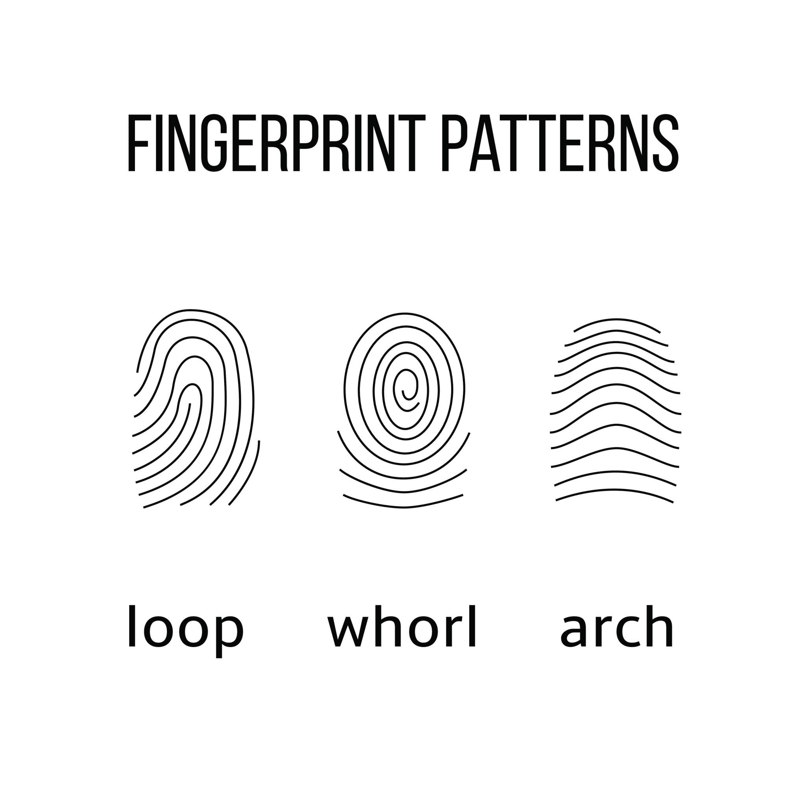
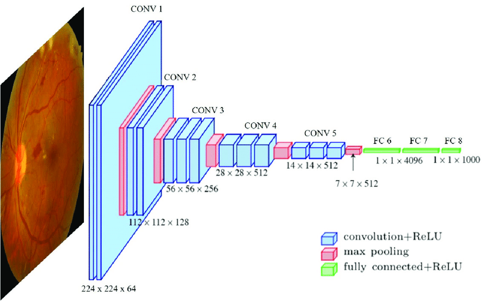

# FingerPrint-BloodGroup-Detector

## Scientific Background & Inspiration
Both epidermal fingerprint ridges and blood group antigens are genetically determined during early intrauterine development (between the 10th and 17th weeks of gestation). The study of fingerprint patterns—known as **Dermatoglyphics**—has revealed statistically significant biological correlations between ABO blood groups and primary ridge pattern distributions:

* **Loops:** Statistically more frequent in individuals with **Blood Group O**.
* **Whorls:** Higher distribution frequency observed in individuals with **Blood Group B**.
* **Arches:** Observed with distinct frequencies across **Blood Groups A and AB**.

### Project Inspiration
Traditional blood grouping requires invasive needle pricks, chemical reagents, and clinical lab infrastructure. This project was inspired by the vision of **non-invasive, contact-free preliminary health screening**—leveraging Computer Vision and Deep Learning to bridge dermatoglyphic medical research with accessible software technology.

---

## Overview
**FingerPrint-BloodGroup-Detector** is an end-to-end Machine Learning web application designed to analyze fingerprint images and classify correlated blood groups. Built using Python, TensorFlow/Keras, and Flask, the system preprocesses ridge minutiae and extracts feature representations to evaluate potential dermatoglyphic markers automatically.

## Architecture

### Key Features
* **Dermatoglyphic Feature Extraction:** Analyzes primary fingerprint pattern structures (Loops, Whorls, Arches) alongside ridge densities.

* **Deep Learning Pipeline:** Employs VGG16 architecture for feature extraction and classification, fine-tuned on a curated dataset of fingerprint images labeled with corresponding blood groups.

